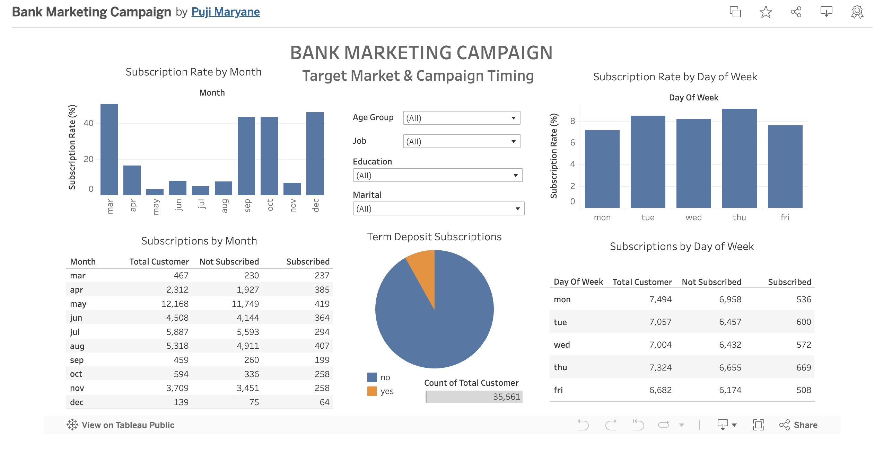

# Bank Marketing Campaign Analysis - DTI Data Science #26 Final Project

## Team Theta

Team Theta Final Project Repo for DTI Data Science #26

## Project Overview

This project is a comprehensive analysis of a bank marketing campaign dataset. The goal is to predict whether a client will subscribe to a term deposit based on various features.

## Data

The dataset used in this project is the Bank Marketing Campaign dataset, which can be found [here](https://www.kaggle.com/code/benroshan/bank-marketing-campaign-predictive-analytics).

## Data Visualization

Tableau Dashboard: [Bank Marketing Campaign Analysis](https://public.tableau.com/app/profile/puji.maryane/viz/BankMarketingCampaign_17404888788890/Dashboard1)

### Dashboard



## How to run the code

### Prerequisites

- Python 3.12
- Jupyter Notebook
- Required libraries (see `requirements.txt`)

### Installation

1. Clone the repository

```bash
git clone https://github.com/team-theta-dtids/final-project
```

2. Install Python virtual environment

```bash
python -m venv venv
```

3. Activate the virtual environment

```bash
source venv/bin/activate
```

4. Install the required libraries

```bash
pip install -r requirements.txt
```

### Running the code

Open Notebook `main_new.ipynb` and run all the cells.


### Running the Streamlit app

```bash
streamlit run app.py
```

# Contributors

- [Puji Maryane](https://github.com/pujimaryanepn)
- [Timothy Chiesa](https://github.com/timothyciesha)
- [Andre Suchitra](https://github.com/andresuchdata)
